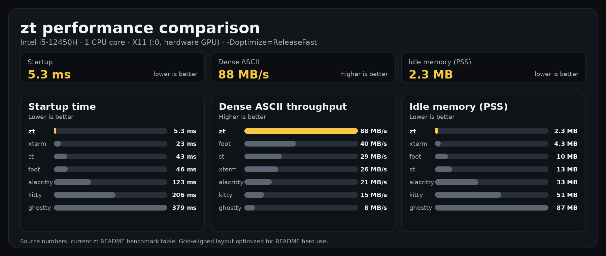

# zt — minimal terminal emulator in Zig

[](https://ziglang.org)
[](LICENSE)
[](https://kernel.org)

A small terminal emulator written in Zig. Renders to the Linux framebuffer, X11 (XCB + SHM), Wayland (pure Zig wire protocol, no libwayland), or macOS (Cocoa/AppKit, untested). No GPU required.


Originally built for the [HackberryPi Zero](https://github.com/ZitaoTech/Hackberry-Pi_Zero) (RPi Zero 2W + 720x720 HyperPixel4). Runs on any Linux system.

> **Note:** This is an experimental project. It works well enough for daily use with common CLI tools, but it is not a full-featured terminal. See [Limitations](#limitations) for what's missing.

## Benchmarks



Measured on Intel i5-12450H, 1 CPU core, X11 (:0, hardware GPU), `-Doptimize=ReleaseFast`. See [zt-bench](https://github.com/midasdf/zt-bench) for methodology, detailed results, and how to reproduce.

## Features

### Rendering

- **Four backends** — framebuffer (no X11/Wayland), XCB + SHM under X11, pure Zig Wayland client (no libwayland), Cocoa/AppKit on macOS (experimental, untested)
- **Pixel scaling** — `-Dscale=2` or `-Dscale=4` for HiDPI. Integer scaling, same font blob
- **Double-buffered SHM** — tear-free rendering on X11 and Wayland
- **Adaptive frame limiter** — reduces FPS under heavy output to avoid wasting CPU

### Terminal

- **xterm-256color + 24-bit TrueColor** — SGR attributes (bold, italic, underline, reverse, dim, strikethrough), styled underlines (single/double/curly/dotted/dashed) with custom colors, DEC modes, alternate screen
- **Bracketed paste** — DECSET 2004
- **CJK wide characters** — double-width rendering with boundary repair
- **59,635 glyphs** — UFO bitmap font + Nerd Fonts icons, embedded at compile time
- **XKB keyboard layout** — any X11/Wayland layout (US, JP, DE, FR, etc.)
- **Input method** — XIM under X11, text-input-v3 under Wayland (fcitx5, ibus, etc.)
- **OSC 8 hyperlinks** — parsed and stored; click-to-open is not yet implemented
- **OSC 52 clipboard** — copy to system clipboard via xclip/wl-copy (disabled by default for security)

### Performance

- **Bulk ASCII fast path** — SIMD 16-byte range check, 8-byte template cell writes
- **UTF-8 bulk path** — multi-byte sequences decoded directly in ground state
- **Row-map scroll** — O(1) scroll via row indirection instead of copying cells
- **Damage tracking** — per-cell dirty flag, row-level skip
- **Comptime configuration** — backend, font, palette, scale resolved at compile time

## Build

Requires Zig 0.15+.

|  | fbdev | X11 | Wayland |
|---|---|---|---|
| Binary (stripped, with 59K-glyph font) | ~3 MB | ~3 MB | ~3 MB |
| Runtime dependencies | none | libxcb, libxcb-shm, libxcb-xkb, libxkbcommon, libxcb-imdkit | libxkbcommon |

### Quick Start

```sh
# X11
zig build -Dbackend=x11 -Doptimize=ReleaseFast

# Wayland
zig build -Dbackend=wayland -Doptimize=ReleaseFast

# Framebuffer (bare Linux console, no X/Wayland)
zig build -Doptimize=ReleaseSmall

# Run
./zig-out/bin/zt
```

Add `-Dstrip=true` to remove debug symbols.

### More Options

```sh
# HiDPI (2x or 4x pixel scaling)
zig build -Dbackend=x11 -Dscale=2 -Doptimize=ReleaseFast

# Custom shell (default: /bin/sh)
zig build -Dbackend=x11 -Dshell=/bin/fish -Doptimize=ReleaseFast

# 60fps cap (battery saving)
zig build -Dbackend=x11 -Dmax_fps=60 -Doptimize=ReleaseFast

# Smaller PTY buffer (conserve memory)
zig build -Dbackend=x11 -Dpty_buf_kb=256 -Doptimize=ReleaseSmall

# Cross-compile for aarch64
zig build -Dtarget=aarch64-linux -Doptimize=ReleaseSmall

# macOS (experimental, untested — see note below)
zig build -Dbackend=macos -Dshell=/bin/zsh -Doptimize=ReleaseFast

# Run tests
zig build test
```

### Wayland Backend

Implements the Wayland wire protocol directly in Zig — no libwayland-client dependency. Only `libxkbcommon` is needed for keyboard layout.

Supported protocols: xdg-shell, wl_shm, text-input-v3 (IME), wl_data_device + primary selection (clipboard), xdg-decoration, wp_cursor_shape_manager_v1.

### macOS Backend (Experimental)

> **Note:** Developed without access to macOS hardware and never tested on a real Mac. Uses Cocoa/AppKit via `objc_msgSend` from Zig. Bug reports welcome.

## Status

| Backend | Status |
|---------|--------|
| fbdev | Stable — used daily on HackberryPi |
| X11 | Stable — primary development target |
| Wayland | Works — IME and basic usage tested |
| macOS | Untested — compiles but never run on real hardware |

## Configuration

Edit `config.zig` and rebuild — [st](https://st.suckless.org/)-style, no runtime config files.

```zig
pub const backend: Backend = .fbdev;  // set via -Dbackend
pub const keymap: Keymap = .us;       // set via -Dkeymap (fbdev only)
pub const default_fg: u8 = 7;        // white
pub const default_bg: u8 = 0;        // black
pub const font_width: u32 = 8;
pub const font_height: u32 = 16;
pub const scale: u32 = 1;            // set via -Dscale
pub const max_fps: u32 = 120;        // set via -Dmax_fps (0 = unlimited)
```

## Font

Embeds a pre-compiled binary font blob at compile time. The default includes ~60K glyphs (Latin, Japanese, Nerd Fonts icons).

```sh
curl -Lo src/fonts/ufo-nf.bin https://github.com/midasdf/zt-fonts/raw/main/ufo-nf.bin
```

See [zt-fonts](https://github.com/midasdf/zt-fonts) for sources, build scripts, and custom fonts.

## Architecture

```
epoll event loop (single-threaded)
├── PTY reader → VT parser → cell grid
│   ├── ASCII fast path (SIMD bulk write)
│   └── UTF-8 fast path (direct decode)
├── Input (evdev / XKB+XIM / XKB+text-input-v3)
├── Renderer (dirty-region, frame-limited)
├── Backend (fbdev mmap / X11 SHM / Wayland wl_shm)
└── Signals, timers, write buffering
```

## Tested Applications

vim, nano, micro, less, bat, top, btop, man, git, eza, tree, ripgrep, python3 REPL, fish, Claude Code

Some applications may have minor rendering issues due to missing features (see below).

## Limitations

- **No scrollback buffer** — only the current viewport
- **No mouse support** — mouse tracking sequences are accepted but ignored
- **No clipboard paste on fbdev** — X11/Wayland support Ctrl+Shift+V
- **No inline pre-edit display** — IME uses its own popup window
- **No font fallback** — single embedded font, no system font lookup
- **No ligatures**
- **No sixel/image protocol**
- **Blink attribute** — parsed but not visually rendered
- **fbdev keymap** — compile-time only (US/JP); X11/Wayland use XKB

<details>
<summary>Supported escape sequences</summary>

### CSI sequences

| Sequence | Name | Description |
|----------|------|-------------|
| `CSI n A` | CUU | Cursor up |
| `CSI n B/e` | CUD/VPR | Cursor down |
| `CSI n C/a` | CUF/HPR | Cursor forward |
| `CSI n D` | CUB | Cursor back |
| `CSI n E` | CNL | Cursor next line |
| `CSI n F` | CPL | Cursor preceding line |
| `CSI n G/`` | CHA/HPA | Cursor horizontal absolute |
| `CSI n;m H/f` | CUP | Cursor position |
| `CSI n I` | CHT | Cursor forward tabulation |
| `CSI n J` | ED | Erase display (0: below, 1: above, 2/3: all) |
| `CSI n K` | EL | Erase line (0: right, 1: left, 2: all) |
| `CSI n L` | IL | Insert lines |
| `CSI n M` | DL | Delete lines |
| `CSI n P` | DCH | Delete characters |
| `CSI n X` | ECH | Erase characters |
| `CSI n @` | ICH | Insert characters |
| `CSI n Z` | CBT | Cursor backward tabulation |
| `CSI n b` | REP | Repeat preceding graphic character |
| `CSI n S` | SU | Scroll up |
| `CSI n T` | SD | Scroll down |
| `CSI n d` | VPA | Vertical position absolute |
| `CSI n g` | TBC | Tab clear (0: current, 3: all) |
| `CSI t;b r` | DECSTBM | Set scroll region |
| `CSI s` | | Save cursor position |
| `CSI u` | | Restore cursor position |
| `CSI 5 n` | DSR | Device status report (OK) |
| `CSI 6 n` | DSR | Cursor position report |
| `CSI c` | DA1 | Device attributes |
| `CSI > c` | DA2 | Secondary device attributes |
| `CSI ! p` | DECSTR | Soft terminal reset |
| `CSI Ps SP q` | DECSCUSR | Set cursor style |
| `CSI Ps $ p` | DECRQM | Mode query |
| `CSI 4 h/l` | IRM | Insert/replace mode |
| `CSI ... m` | SGR | Select graphic rendition |

### SGR

| Code | Effect |
|------|--------|
| 0 | Reset all |
| 1 | Bold |
| 2 | Dim |
| 3 | Italic |
| 4, 4:1-4:5 | Underline (single/double/curly/dotted/dashed) |
| 7 | Reverse video |
| 9 | Strikethrough |
| 30-37, 90-97 | Foreground color |
| 38;5;n | 256-color foreground |
| 38;2;r;g;b | TrueColor foreground |
| 40-47, 100-107 | Background color |
| 48;5;n | 256-color background |
| 48;2;r;g;b | TrueColor background |
| 58;5;n / 58;2;r;g;b | Underline color |

### DEC private modes

| Mode | Description |
|------|-------------|
| `?1` | Application cursor keys |
| `?7` | Auto-wrap |
| `?25` | Cursor visible |
| `?47`, `?1047`, `?1049` | Alternate screen |
| `?2004` | Bracketed paste |
| `?2026` | Synchronized update |
| `?1004` | Focus events |

### OSC sequences

| Sequence | Description |
|----------|-------------|
| `OSC 0/2` | Set window title |
| `OSC 8` | Hyperlinks (parsed, click not implemented) |
| `OSC 52` | Clipboard copy (disabled by default) |
| `OSC 10/11/12` | Query fg/bg/cursor color |

### DCS sequences

| Sequence | Description |
|----------|-------------|
| `DCS + q` | XTGETTCAP |
| `DCS $ q` | DECRQSS |

</details>

## License

MIT

## Disclaimer
This project uses AI-generated code (LLM). I do my best to review and test it, but I can't guarantee it's perfect. Please use it at your own risk.\n