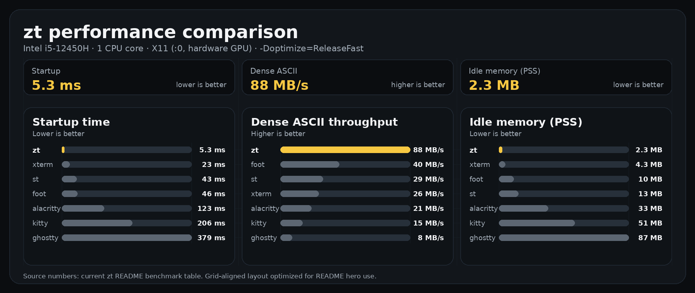

# zt — minimal terminal emulator in Zig

[](https://ziglang.org)
[](LICENSE)
[](https://github.com/midasdf/zt/releases/tag/v0.11.0)
[](https://kernel.org)

A small terminal emulator for **macOS and Linux**, written in Zig. Native Cocoa/AppKit on Mac; framebuffer, X11 (XCB + SHM), and Wayland (pure Zig wire protocol, no libwayland) on Linux. No GPU required.

**New in 0.11.0: Zig 0.17 support** — source builds, font tools, CI, and release packaging now use Zig 0.17.0. Multiple Mac terminals remain supported: open a new window with Cmd+N, the Dock's right-click menu, or by opening `zt.app` again. Native Mac support covers Apple Silicon and Intel on macOS 14+. Download a Finder-launchable `zt.app` from the [0.11.0 release](https://github.com/midasdf/zt/releases/tag/v0.11.0), or [build with Homebrew](#macos-backend).


Originally built for the [HackberryPi Zero](https://github.com/ZitaoTech/Hackberry-Pi_Zero) (RPi Zero 2W + 720x720 HyperPixel4). Now supports macOS as well as Linux.

> **Note:** This is an experimental project. It works well enough for daily use with common CLI tools, but it is not a full-featured terminal. See [Limitations](#limitations) for what's missing.

## Benchmarks



Measured on Intel i5-12450H, 1 CPU core, X11 (:0, hardware GPU), `-Doptimize=ReleaseFast`. See [zt-bench](https://github.com/midasdf/zt-bench) for methodology, detailed results, and how to reproduce.

## Features

### Rendering

- **Four backends** — framebuffer (no X11/Wayland), XCB + SHM under X11, pure Zig Wayland client (no libwayland), Cocoa/AppKit on macOS
- **Pixel scaling** — `-Dscale=2` or `-Dscale=4` for HiDPI. Integer scaling, same font blob
- **Double-buffered SHM** — tear-free rendering on X11 and Wayland
- **Adaptive frame limiter** — reduces FPS under heavy output to avoid wasting CPU

### Terminal

- **xterm-256color + 24-bit TrueColor** — SGR attributes (bold, italic, underline, reverse, dim, strikethrough), styled underlines (single/double/curly/dotted/dashed) with custom colors, DEC modes, alternate screen
- **Bracketed paste** — DECSET 2004
- **CJK wide characters** — double-width rendering with boundary repair
- **59,635 glyphs** — UFO bitmap font + Nerd Fonts icons, embedded at compile time
- **XKB keyboard layout** — any X11/Wayland layout (US, JP, DE, FR, etc.)
- **Input method** — native AppKit input methods on macOS, XIM under X11, and text-input-v3 under Wayland (fcitx5, ibus, etc.)
- **Inline pre-edit (IME composition)** — macOS AppKit and Wayland `text-input-v3` preedit; composition text is rendered at the cursor position with reverse-video / underline / highlight feedback from the IME
- **OSC 8 hyperlinks** — parsed and stored; click-to-open is not yet implemented
- **OSC 52 clipboard** — copy to system clipboard via pbcopy on macOS or xclip/wl-copy on Linux (disabled by default for security)

### Performance

- **Bulk ASCII fast path** — SIMD 16-byte range check, 8-byte template cell writes
- **UTF-8 bulk path** — multi-byte sequences decoded directly in ground state
- **Row-map scroll** — O(1) scroll via row indirection instead of copying cells
- **Lazy metadata planes** — TrueColor, underline-color and hyperlink arrays are only written while those features are in use
- **Damage tracking** — per-cell dirty flag, row-level skip
- **Comptime configuration** — backend, font, palette, scale resolved at compile time

## Build

Requires Zig 0.17.0. See the [migration notes](docs/zig-0.17-migration.md) for changes and verification results.

|  | fbdev | X11 | Wayland |
|---|---|---|---|
| Binary (stripped, with 59K-glyph font) | ~3 MB | ~3 MB | ~3 MB |
| Runtime dependencies | none | libxcb, libxcb-shm, libxcb-xkb, libxkbcommon, libxcb-imdkit | libxkbcommon |

### Quick Start

On macOS, download `zt-aarch64-macos.zip` for Apple Silicon or
`zt-x86_64-macos.zip` for Intel from the [latest release](https://github.com/midasdf/zt/releases/latest),
extract it, and open `zt.app`. To build from source:

```sh
brew install zig
zig version # must report 0.17.0
zig build -Doptimize=ReleaseFast
sh tools/package-macos.sh
open zig-out/zt.app
```

On Linux:

```sh
# X11
zig build -Dbackend=x11 -Doptimize=ReleaseFast

# Wayland
zig build -Dbackend=wayland -Doptimize=ReleaseFast

# Framebuffer (bare Linux console, no X/Wayland)
zig build -Doptimize=ReleaseSmall

# Run
./zig-out/bin/zt
```

Add `-Dstrip=true` to remove debug symbols.

### More Options

```sh
# HiDPI (2x or 4x pixel scaling)
zig build -Dbackend=x11 -Dscale=2 -Doptimize=ReleaseFast

# Custom shell (default: /bin/sh)
zig build -Dbackend=x11 -Dshell=/bin/fish -Doptimize=ReleaseFast

# 60fps cap (battery saving)
zig build -Dbackend=x11 -Dmax_fps=60 -Doptimize=ReleaseFast

# Smaller PTY buffer (conserve memory)
zig build -Dbackend=x11 -Dpty_buf_kb=256 -Doptimize=ReleaseSmall

# Disable scrollback (smaller binary, no scroll history)
zig build -Dbackend=x11 -Dscrollback_lines=0 -Doptimize=ReleaseFast

# Smaller scrollback (lower memory)
zig build -Dbackend=x11 -Dscrollback_lines=2000 -Doptimize=ReleaseFast

# Wheel scrolls alt-screen scrollback (for codex CLI / long TUI sessions).
# Default off: wheel translates to arrow keys in alt screen (less/vim compat).
zig build -Dbackend=x11 -Dalt_screen_wheel_scrollback=true -Doptimize=ReleaseFast

# Custom BDF or TTF font (experimental — see Font section)
zig build -Dbackend=x11 -Dfont=path/to/myfont.ttf -Doptimize=ReleaseFast

# Cross-compile for aarch64
zig build -Dtarget=aarch64-linux -Doptimize=ReleaseSmall

# macOS (automatically selects Cocoa and /bin/zsh)
zig build -Doptimize=ReleaseFast

# Run tests
zig build test
```

### Wayland Backend

Implements the Wayland wire protocol directly in Zig — no libwayland-client dependency. Only `libxkbcommon` is needed for keyboard layout.

Supported protocols: xdg-shell, wl_shm, text-input-v3 (IME), wl_data_device + primary selection (clipboard), xdg-decoration, wp_cursor_shape_manager_v1.

### macOS Backend

Uses Cocoa/AppKit and CoreGraphics without X11 or third-party runtime libraries.
Requires macOS 14 or later. The native macOS build selects the Cocoa backend and `/bin/zsh` automatically.
Install Xcode Command Line Tools (`xcode-select --install`) and **Zig 0.17.0**.
Install the compiler with Homebrew (or download Zig 0.17.0 from [ziglang.org](https://ziglang.org/download/)):

```sh
brew install zig
zig version # must report 0.17.0
```

```sh
# Build and launch from Terminal
zig build -Doptimize=ReleaseFast
./zig-out/bin/zt

# Optional: larger text with 2x bitmap scaling
zig build -Dscale=2 -Doptimize=ReleaseFast

# Create a Finder-launchable app
sh tools/package-macos.sh
open zig-out/zt.app

# Unit tests, including real PTY I/O
zig build test

# Cocoa integration tests (requires a desktop session)
zig build test -Dmacos_gui_tests=true
```

`Cmd+N` (File → New Window) opens a new terminal with its own process and shell.
You can also right-click the running app's Dock icon and choose **New Window**.
Opening `zt.app` again from Finder, the Dock, or `open zig-out/zt.app` also opens a
new terminal instead of only activating the existing one. `open -n zig-out/zt.app`
explicitly launches another instance. Closing one terminal does not close the others;
`Cmd+Q` quits the current instance.

`Cmd+C` copies the selection, `Cmd+V` pastes, and `Cmd+Q` / `Cmd+W` close
zt. Mouse selection, wheel scrolling, terminal mouse reporting, and native
input-method composition use the same dispatcher as the Linux backends.
App bundles start the shell in your home directory; CLI launches preserve the
current directory. Option acts as the terminal Alt modifier. IME composition is shown inline,
and the candidate window is positioned at the cursor.

The CI configuration builds and runs tests on Apple Silicon and Intel macOS.
The release workflow produces architecture-specific `.bin` executables and
`.zip` app bundles. App bundles use ad hoc signatures; they are not notarized.
Automated Cocoa tests cover window creation, drawing, text/IME callbacks,
keyboard modifiers, large pastes, resizing, and closing. Physical keyboard,
IME candidate selection, and display changes require manual checks; see
[the macOS QA checklist](docs/macos-qa.md).

## Status

| Backend | Status |
|---------|--------|
| fbdev | Stable — used daily on HackberryPi |
| X11 | Stable — primary development target |
| Wayland | Works — IME and basic usage tested |
| macOS | Supported — Cocoa, Apple Silicon and Intel; macOS 14+ |

## Configuration

Edit `config.zig` and rebuild — [st](https://st.suckless.org/)-style, no runtime config files.

```zig
pub const backend: Backend = .fbdev;  // set via -Dbackend
pub const keymap: Keymap = .us;       // set via -Dkeymap (fbdev only)
pub const default_fg: u8 = 7;        // white
pub const default_bg: u8 = 0;        // black
pub const font_width: u32 = 8;
pub const font_height: u32 = 16;
pub const scale: u32 = 1;            // set via -Dscale
pub const max_fps: u32 = 120;        // set via -Dmax_fps (0 = unlimited)
```

## Font

Embeds a pre-compiled binary font blob at compile time. The default includes ~60K glyphs (Latin, Japanese, Nerd Fonts icons).

```sh
curl -Lo src/fonts/ufo-nf.bin https://github.com/midasdf/zt-fonts/raw/main/ufo-nf.bin
```

See [zt-fonts](https://github.com/midasdf/zt-fonts) for sources, build scripts, and custom fonts.

### Custom fonts (experimental)

You can embed your own font instead of the default blob with `-Dfont`. Both
bitmap (BDF) and TrueType outline (TTF) fonts are accepted:

```sh
# Bitmap font
zig build -Dbackend=x11 -Dfont=path/to/myfont.bdf -Doptimize=ReleaseFast

# TrueType outline font (rasterized to the 8x16 cell at build time)
zig build -Dbackend=x11 -Dfont=path/to/myfont.ttf -Doptimize=ReleaseFast
```

Everything happens at build time via pure-Zig host tools, with **no external
dependencies** (no FreeType, no FontForge):

- `tools/ttf2bdf.zig` rasterizes TrueType (`glyf`) outlines into a fixed-cell,
  1-bit BDF — scaling is derived from the font's own metrics (advance width →
  cell width, ascent/descent → cell height).
- `tools/bdf2blob.zig` packs the BDF into zt's binary blob format.

The runtime stays zero-dependency: only the resulting blob is embedded, exactly
as with the default font.

Example — [Topaz NG](https://codeberg.org/ideasman42/font-topaz-ng), a vector
revival of the Amiga Topaz font (its 8×16 cell matches zt natively):

```sh
zig build -Dbackend=x11 -Dfont=TopazNG_Code-Regular.ttf -Doptimize=ReleaseFast
```

> **Experimental.** Glyphs are embedded as 1-bit monochrome bitmaps at the fixed
> 8×16 cell (no antialiasing, no color emoji). TrueType `glyf` outlines only —
> CFF-based **OTF is not supported** (use the `.ttf` variant). Fine-tuning flags
> are available when running `tools/ttf2bdf.zig` directly (`--baseline`,
> `--xscale`, `--yscale`, `--xoff`, `--preview`).

## Architecture

```
epoll event loop (single-threaded)
├── PTY reader → VT parser → cell grid
│   ├── ASCII fast path (SIMD bulk write)
│   └── UTF-8 fast path (direct decode)
├── Input (evdev / XKB+XIM / XKB+text-input-v3)
├── Renderer (dirty-region, frame-limited)
├── Backend (fbdev mmap / X11 SHM / Wayland wl_shm)
└── Signals, timers, write buffering
```

## Keybindings

| Keys | Action |
|------|--------|
| `Ctrl+Shift+C` | Copy selection to clipboard (X11/Wayland) |
| `Ctrl+Shift+V` | Paste from clipboard (X11/Wayland) |
| `Shift+PageUp` / `Shift+PageDown` | Scroll scrollback one page up / down (active ring: main or alt-screen) |
| `Shift+Home` / `Shift+End` | Jump to scrollback top / live bottom (active ring) |
| Left-click drag | Select text |
| Mouse wheel | Scrollback (main screen) / arrow keys (alt screen, default) / scrollback (alt screen with `-Dalt_screen_wheel_scrollback=true`) / app (mouse capture) |

## Tested Applications

vim, nano, micro, less, bat, top, btop, man, git, eza, tree, ripgrep, python3 REPL, fish, Claude Code

Some applications may have minor rendering issues due to missing features (see below).

## Limitations

- **Scrollback** — fixed capacity, set at compile time via `-Dscrollback_lines=N` (default 10000, 0 disables). No reflow on column resize, no selection of scrollback rows yet. Both the main screen and the alt screen have their own session-scoped scrollback rings: the alt ring is created on enter-alt and freed on leave-alt, so `less`/`vim`/`codex` history is scoped to that session and never pollutes the main ring.
- **Mouse wheel** — scrolls scrollback in main screen; translates to arrow keys for `less`/`vim` in alt screen (default); scrolls the alt-screen ring when `-Dalt_screen_wheel_scrollback=true` is set at build time (opt-in for `codex`-style sessions); passes through to apps with mouse capture (`mouse_mode != .none`).
- **No clipboard paste on fbdev** — X11/Wayland support Ctrl+Shift+V
- **Bitmap rendering only** — single embedded blob (1-bit, fixed 8×16 cell), no antialiasing, no runtime system font lookup or fallback. A custom BDF or TTF can be embedded at build time via `-Dfont` (experimental, see [Font](#custom-fonts-experimental))
- **No X11 inline pre-edit display** — XIM uses `PreeditNothing`, so the IME handles composition display
- **No ligatures**
- **No sixel/image protocol**
- **Blink attribute** — parsed but not visually rendered
- **fbdev keymap** — compile-time only (US/JP); X11/Wayland use XKB

<details>
<summary>Supported escape sequences</summary>

### CSI sequences

| Sequence | Name | Description |
|----------|------|-------------|
| `CSI n A` | CUU | Cursor up |
| `CSI n B/e` | CUD/VPR | Cursor down |
| `CSI n C/a` | CUF/HPR | Cursor forward |
| `CSI n D` | CUB | Cursor back |
| `CSI n E` | CNL | Cursor next line |
| `CSI n F` | CPL | Cursor preceding line |
| `CSI n G/`` | CHA/HPA | Cursor horizontal absolute |
| `CSI n;m H/f` | CUP | Cursor position |
| `CSI n I` | CHT | Cursor forward tabulation |
| `CSI n J` | ED | Erase display (0: below, 1: above, 2/3: all) |
| `CSI n K` | EL | Erase line (0: right, 1: left, 2: all) |
| `CSI n L` | IL | Insert lines |
| `CSI n M` | DL | Delete lines |
| `CSI n P` | DCH | Delete characters |
| `CSI n X` | ECH | Erase characters |
| `CSI n @` | ICH | Insert characters |
| `CSI n Z` | CBT | Cursor backward tabulation |
| `CSI n b` | REP | Repeat preceding graphic character |
| `CSI n S` | SU | Scroll up |
| `CSI n T` | SD | Scroll down |
| `CSI n d` | VPA | Vertical position absolute |
| `CSI n g` | TBC | Tab clear (0: current, 3: all) |
| `CSI t;b r` | DECSTBM | Set scroll region |
| `CSI s` | | Save cursor position |
| `CSI u` | | Restore cursor position |
| `CSI 5 n` | DSR | Device status report (OK) |
| `CSI 6 n` | DSR | Cursor position report |
| `CSI c` | DA1 | Device attributes |
| `CSI > c` | DA2 | Secondary device attributes |
| `CSI ! p` | DECSTR | Soft terminal reset |
| `CSI Ps SP q` | DECSCUSR | Set cursor style |
| `CSI Ps $ p` | DECRQM | Mode query |
| `CSI 4 h/l` | IRM | Insert/replace mode |
| `CSI ... m` | SGR | Select graphic rendition |

### SGR

| Code | Effect |
|------|--------|
| 0 | Reset all |
| 1 | Bold |
| 2 | Dim |
| 3 | Italic |
| 4, 4:1-4:5 | Underline (single/double/curly/dotted/dashed) |
| 7 | Reverse video |
| 9 | Strikethrough |
| 30-37, 90-97 | Foreground color |
| 38;5;n | 256-color foreground |
| 38;2;r;g;b | TrueColor foreground |
| 40-47, 100-107 | Background color |
| 48;5;n | 256-color background |
| 48;2;r;g;b | TrueColor background |
| 58;5;n / 58;2;r;g;b | Underline color |

### DEC private modes

| Mode | Description |
|------|-------------|
| `?1` | Application cursor keys |
| `?7` | Auto-wrap |
| `?25` | Cursor visible |
| `?47`, `?1047`, `?1049` | Alternate screen |
| `?2004` | Bracketed paste |
| `?2026` | Synchronized update |
| `?1004` | Focus events |

### OSC sequences

| Sequence | Description |
|----------|-------------|
| `OSC 0/2` | Set window title |
| `OSC 8` | Hyperlinks (parsed, click not implemented) |
| `OSC 52` | Clipboard copy (disabled by default) |
| `OSC 10/11/12` | Query fg/bg/cursor color |

### DCS sequences

| Sequence | Description |
|----------|-------------|
| `DCS + q` | XTGETTCAP |
| `DCS $ q` | DECRQSS |

</details>

## License

MIT

## Disclaimer
This project uses AI-generated code (LLM). I do my best to review and test it, but I can't guarantee it's perfect. Please use it at your own risk.\n
